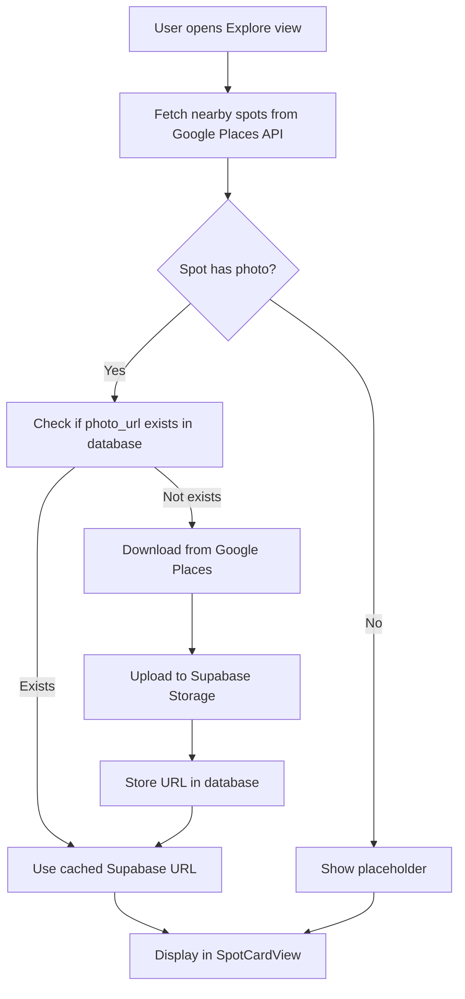

# Spot Images Implementation - Setup Guide

## Overview

This implementation adds cover images to spot cards by fetching photos from Google Places API, uploading them to Supabase Storage for caching, and displaying them in the app. This significantly reduces API costs by storing images once instead of fetching them repeatedly.

## What Was Implemented

### ✅ Database Changes
- Added `photo_url` and `photo_reference` columns to the `spots` table
- Updated `upsert_spot` database function to accept photo parameters
- Modified to use `COALESCE` to preserve existing photo URLs when updating

### ✅ Swift Models
- Updated `Spot` model with `photoUrl` and `photoReference` fields
- Updated `NearbySpot` model with `photoUrl` field
- Modified `photoURL()` method to prefer Supabase cached URLs over Google API calls

### ✅ Image Storage Service
- Created `ImageStorageService.swift` for managing image uploads
- Downloads images from Google Places Photo API
- Uploads images to Supabase Storage
- Returns public CDN URLs for fast access

### ✅ Places API Integration
- Modified `PlacesAPIService.searchNearby()` to check for existing cached images
- Automatically uploads new spot images in the background
- Updates database with photo URLs after successful upload

### ✅ Location Saving Integration
- Updated `LocationSavingService.upsertSpot()` to accept photo parameters
- Added lazy image loading for saved spots without cached images
- Modified `getSpotsInList()` to trigger background image fetches

### ✅ UI Updates
- `SpotCardView` already uses the updated `photoURL()` method
- Automatically displays Supabase cached images when available
- Falls back to Google API, then to placeholder if no image exists

## Setup Steps

### Step 1: Run Database Migration

1. Open Supabase Dashboard → SQL Editor
2. Copy the contents of `create_location_saving_schema.sql`
3. Run the migration (the updated schema includes photo fields)

**Note:** If you've already run the initial migration, run this to add the new columns:

```sql
-- Add photo columns to existing spots table
ALTER TABLE public.spots 
ADD COLUMN IF NOT EXISTS photo_url TEXT,
ADD COLUMN IF NOT EXISTS photo_reference TEXT;

-- Add comments
COMMENT ON COLUMN public.spots.photo_url IS 'Supabase Storage public URL for the spot cover image. Cached to reduce Google Places API costs.';
COMMENT ON COLUMN public.spots.photo_reference IS 'Original Google Places photo reference. Used as backup or for refreshing the cached image.';

-- Update the upsert_spot function
-- (Copy the entire updated function from create_location_saving_schema.sql)
```

### Step 2: Create Supabase Storage Bucket

1. Go to Supabase Dashboard → Storage
2. Click **"Create a new bucket"**
3. Bucket name: `spot-images`
4. Set as **Public bucket** (images are not sensitive)
5. Configure:
   - File size limit: 5MB
   - Allowed MIME types: `image/jpeg, image/png, image/webp`
6. Click **Create**

### Step 3: Set Up Storage RLS Policies

1. Go to Supabase Dashboard → SQL Editor
2. Copy and run the contents of `setup_spot_images_storage.sql`:

```sql
-- Policy: Anyone can read/view images (public bucket)
CREATE POLICY "Public Access"
ON storage.objects FOR SELECT
TO public
USING (bucket_id = 'spot-images');

-- Policy: Authenticated users can upload images
CREATE POLICY "Authenticated users can upload spot images"
ON storage.objects FOR INSERT
TO authenticated
WITH CHECK (bucket_id = 'spot-images');

-- Policy: Authenticated users can update spot images
CREATE POLICY "Authenticated users can update spot images"
ON storage.objects FOR UPDATE
TO authenticated
USING (bucket_id = 'spot-images');

-- Policy: Authenticated users can delete images
CREATE POLICY "Authenticated users can delete spot images"
ON storage.objects FOR DELETE
TO authenticated
USING (bucket_id = 'spot-images');
```

### Step 4: Test the Implementation

1. Build and run the app
2. Navigate to the Explore view
3. Spots should now display cover images on the cards
4. Check the Xcode console for upload success messages:
   - `✅ ImageStorageService: Successfully uploaded image for {placeId}`
   - `✅ PlacesAPIService: Uploaded image for {spotName}`

### Step 5: Verify in Supabase

#### Check Storage Bucket
1. Go to Supabase Dashboard → Storage → spot-images
2. You should see image files named like `ChIJ..._.jpg`
3. Click on any image to verify it loads correctly

#### Check Database
1. Go to Supabase Dashboard → Table Editor → spots
2. Check that `photo_url` and `photo_reference` columns are populated
3. Copy a `photo_url` value and open it in a browser to verify it works

## How It Works

### Image Flow



### Cost Optimization

**Before:**
- Each spot card view = 1 Google Places Photo API call
- Viewing 10 spots 3 times = 30 API calls

**After:**
- First view: 10 spots = 10 API calls + 10 uploads to Supabase
- Subsequent views: 10 spots = 0 API calls (served from Supabase CDN)
- **Savings: ~66% reduction in API calls** for repeated views

### Lazy Loading for Existing Spots

When saved spots are viewed from lists:
1. If `photo_url` is null but `photo_reference` exists
2. Background task downloads image from Google
3. Uploads to Supabase Storage
4. Updates database with new `photo_url`
5. Future views use cached URL (no more API calls)

## File Structure

```
Spots.Test/
├── ImageStorageService.swift          # New: Handles Supabase uploads
├── PlacesAPIService.swift             # Modified: Image upload logic
├── LocationSavingService.swift        # Modified: Photo URL support
├── LocationSavingViewModel.swift      # Modified: Photo parameters
├── Spot.swift                         # Modified: Photo fields
├── NearbySpot.swift                   # Modified: Photo fields + URL logic
└── Components/
    └── SpotCardView.swift             # Already working (no changes needed)

Database/
├── create_location_saving_schema.sql  # Modified: Photo columns + function
└── setup_spot_images_storage.sql      # New: Storage bucket RLS policies
```

## Troubleshooting

### Images Not Showing
1. Check Xcode console for upload errors
2. Verify Supabase Storage bucket exists and is public
3. Check RLS policies are active
4. Verify Google Places API key has Photo API enabled

### Upload Failures
- **403 Forbidden**: Check Supabase RLS policies
- **Invalid URL**: Verify Supabase URL in `SupabaseManager.swift`
- **Google API Error**: Check API key and iOS restrictions

### Performance Issues
- Images upload in background (non-blocking)
- First load may be slower as images are cached
- Subsequent loads are fast (CDN-served)

## Future Enhancements

- [ ] Image compression before upload (reduce storage costs)
- [ ] Progressive image loading with thumbnails
- [ ] Cache expiration and refresh logic
- [ ] Batch upload optimization
- [ ] Offline support with local caching

## Support

If you encounter issues:
1. Check Xcode console logs for error messages
2. Verify Supabase Storage configuration
3. Test with a single spot first before bulk operations
4. Review RLS policies for proper permissions

---

**Implementation completed on:** January 12, 2026  
**All TODOs:** ✅ Completed  
**Linter Errors:** None
